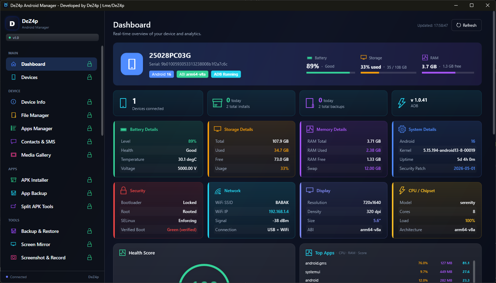
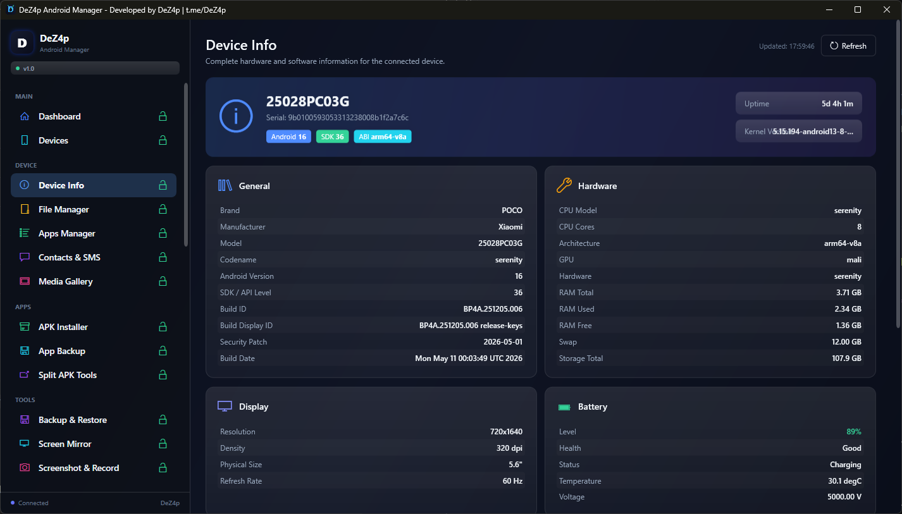
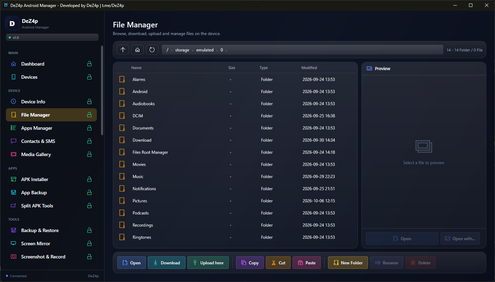
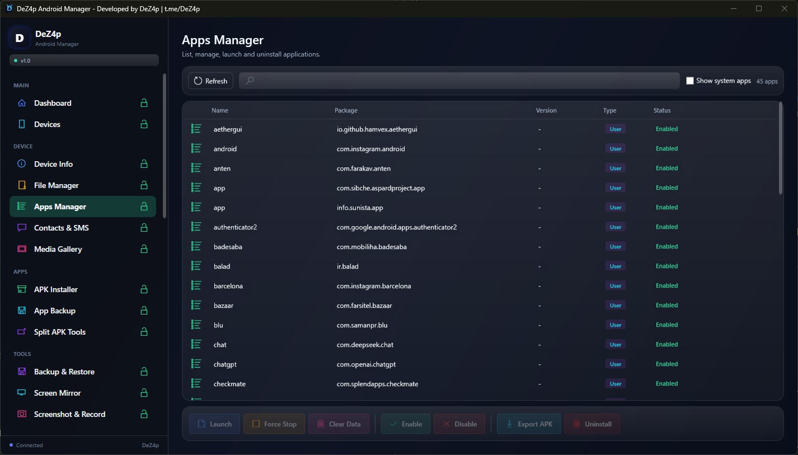
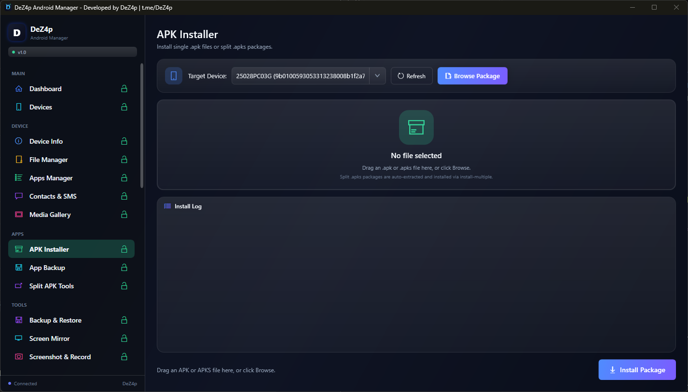
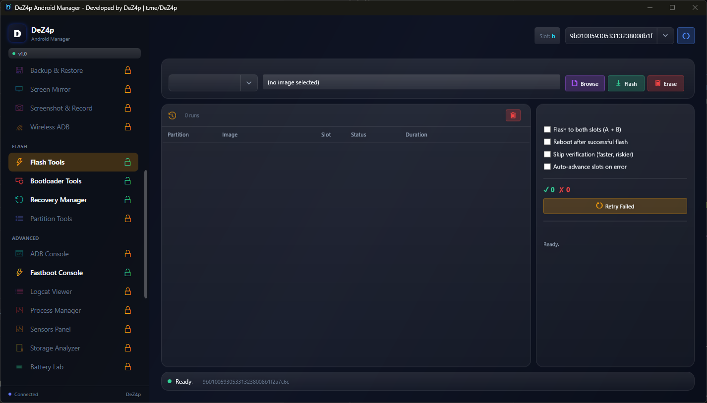
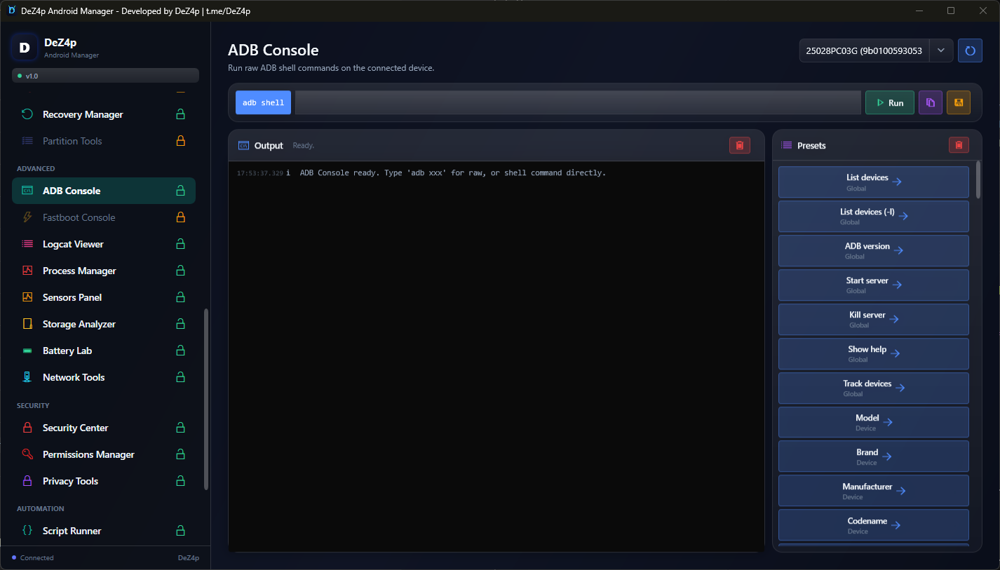
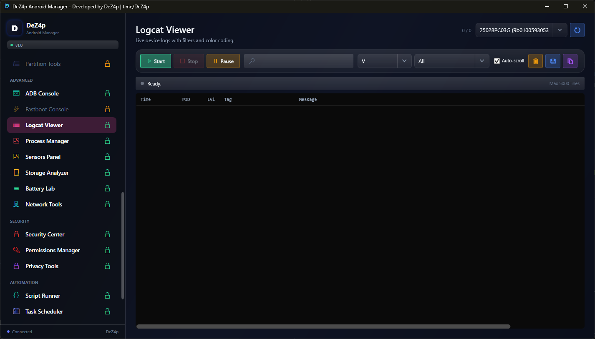
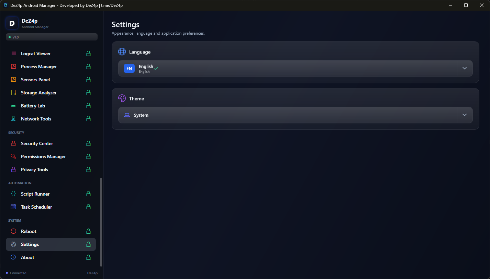
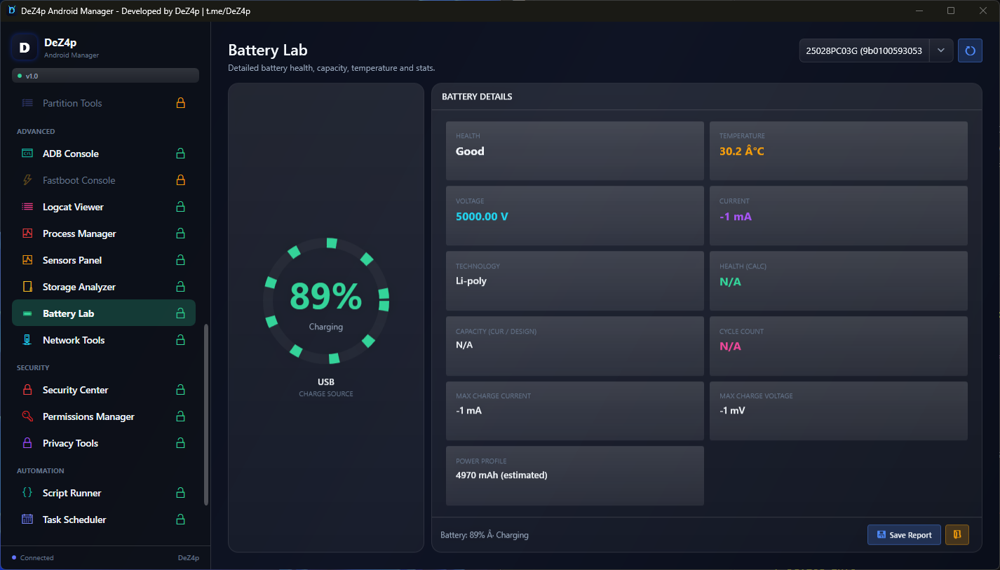

<!-- (c) DeZ4p | t.me/DeZ4p | All Rights Reserved -->

**Language / زبان:** &nbsp;
[English](README.md) &nbsp;|&nbsp; [فارسی](README.fa.md)

---
<div align="center">

# DeZ4p Android Manager

**The complete Windows toolkit for Android device management.**

**ADB - Fastboot - Flash - Monitor - File Manager - Everything.**

[](https://github.com/DeZ4p/DeZ4pAndroidManager/actions/workflows/build.yml)
[](https://github.com/DeZ4p/DeZ4pAndroidManager/releases)
[](LICENSE)
[](https://dotnet.microsoft.com/)
[](#system-requirements)
[](#system-requirements)

**Developed by [DeZ4p](https://t.me/DeZ4p) - t.me/DeZ4p**

</div>

---

## Table of Contents

- [Screenshots](#screenshots)
- [What is this?](#what-is-this)
- [Features](#features)
- [Download](#download)
- [First Use](#first-use)
- [System Requirements](#system-requirements)
- [Tested On](#tested-on)
- [Build from Source](#build-from-source)
- [Project Structure](#project-structure)
- [Tech Stack](#tech-stack)
- [Reporting Bugs](#reporting-bugs)
- [License](#license)
- 

---

## Screenshots

<div align="center">

### Dashboard
Real-time device overview with battery, RAM, storage, CPU, network, and health score.



### Device Info
Complete hardware and software information — 60+ fields.



### File Manager
Browse, download, upload, and manage files on the device.



### Apps Manager
List installed apps, get APK info, uninstall.



### APK Installer
Install single `.apk` files or split `.apks` packages.



### Flash Tools
Flash boot, recovery, system, and vendor partitions.



### ADB Console
Interactive `adb shell` with output capture.



### Logcat Viewer
Real-time device logs with filter.



### Settings
Themes, language, and application preferences.



### Battery Lab
Cycle count, design capacity, current capacity, health, age.



</div>
---

## What is this?

**DeZ4p Android Manager** is a professional Windows desktop application that gives you **complete control over any Android device** — from a single clean interface.

It wraps every day-to-day Android power-user task into one app:

- **Real-time monitoring** of battery, RAM, CPU, storage, network
- **Full file management** (browse, edit, upload, download, copy, rename)
- **APK installation** (single `.apk` + split `.apks`)
- **App management** (list, backup, uninstall)
- **Bootloader / Fastboot / Recovery operations**
- **Partition management** and backup/restore
- **Screen mirroring** with bundled scrcpy
- **Logcat, shell console, process manager, sensors panel**
- **Security center** (SELinux, root, verified boot)
- **Wireless ADB** (Wi-Fi pairing without USB)

And much more — all **bilingual (English + Persian)** with **full RTL support**, **Dark & Light themes**, and **zero runtime dependencies** for the end user.

---

## Features

### 📊 Monitoring & Info

- **Live Dashboard** — Real-time battery level, health, temperature, voltage, storage, RAM, CPU load, network speed, uptime
- **Health Score** — Composite device health score based on multiple factors
- **Top Apps** — Live list of apps by CPU and RAM usage
- **Battery Lab** — Cycle count, design capacity, current capacity, health %, age
- **Thermal Zones** — CPU, GPU, battery, skin temperature sensors
- **Storage Breakdown** — Per-category breakdown of device storage
- **Sensors Panel** — All hardware sensors with live values
- **Device Info** — 60+ fields: brand, model, codename, Android version, SDK, security patch, CPU, GPU, RAM, storage, resolution, density, refresh rate, WiFi, Bluetooth, SIM, baseband, kernel, bootloader, root, SELinux, verified boot

### 📁 File & App Management

- **File Manager** — Browse, download, upload, rename, delete, create folders, multi-select
- **Copy / Cut / Paste** on device
- **APK Installer** — Single `.apk` + split `.apks` (auto-detect via `install-multiple`)
- **Apps Manager** — List installed apps, get APK info, uninstall
- **APK Backup** — Backup APKs from device to PC
- **Split APK Tools** — Extract, analyze, re-sign split APKs
- **Backup & Restore** — Backup / restore apps and data
- **Media Gallery** — Browse photos, videos, audio
- **Contacts & SMS** — Read and backup contacts and messages

### 🔥 Flash & Bootloader

- **Flash Tools** — Flash boot, recovery, system, vendor partitions
- **Bootloader Tools** — Unlock/lock, getvar info, OEM commands
- **Recovery Manager** — Reboot to recovery, sideload, ADB in recovery
- **Partition Tools** — List all partitions, sizes, types, backup individual partitions
- **Reboot Options** — Normal, Recovery, Bootloader, Fastbootd, EDL, Shutdown, SystemUI restart

### 🛠 Advanced

- **ADB Console** — Interactive `adb shell` with output capture
- **Fastboot Console** — Interactive `fastboot` command runner
- **Logcat Viewer** — Real-time device logs with filter
- **Process Manager** — Running processes with CPU, RAM, PID
- **Network Tools** — WiFi, mobile network info, signal strength
- **Script Runner** — Run ADB/Shell scripts
- **Task Scheduler** — Schedule automated ADB tasks

### 🛡 Security & Privacy

- **Security Center** — SELinux status, root detection, verified boot state
- **Permissions Manager** — View app permissions
- **Privacy Tools** — Privacy audit utilities
- **Wireless ADB** — Pair over Wi-Fi without USB (Android 11+)

### 🎥 Media

- **Screen Mirror** — Powered by bundled **scrcpy v5.0**
- **Screenshot** — One-click device screenshot
- **Screen Record** — Record device screen to MP4

### 🎨 UI / UX

- **Bilingual** — English + Persian with full RTL support
- **Dark & Light themes** — Auto-detect from Windows, manual toggle
- **Smooth animations** — 60 FPS transitions
- **DPI aware** — Crisp on 100%, 125%, 150%, 200% scaling
- **Device state gating** — Features auto-lock when mode incompatible
- **Hot-plug** — Automatically detects device connect/disconnect
- **Activity Log** — Persistent event history (last 500 actions)

### âš¡ Performance

- **Self-contained** — No .NET runtime needed
- **Single-file build** — One `.exe` to run
- **Offline** — Works fully without internet
- **Fast startup** — Splash → main window in under 2 seconds

---

## Download

Get the latest version from the [**Releases page**](https://github.com/DeZ4p/DeZ4pAndroidManager/releases/latest).

| File | Description | Size |
|------|-------------|------|
| `DeZ4pAndroidManager-Setup-x64-1.0.0.exe` | **Installer** — recommended | ~95 MB |
| `DeZ4pAndroidManager-Portable-x64-1.0.0.zip` | **Portable** — no install | ~103 MB |

**Why so big?** The app is fully self-contained — it includes the .NET 8 runtime (~70 MB) plus bundled `adb`, `fastboot`, and `scrcpy`. **No additional downloads needed.**

---

## First Use

### Step 1 — Enable USB Debugging on your Android device

1. Open **Settings** → **About Phone**
2. Tap **Build Number** 7 times (a toast will say "You are now a developer")
3. Go back → **Developer Options** → enable **USB Debugging**

### Step 2 — Connect your device

1. Plug your Android device into your PC via USB
2. On the device, a dialog appears: **Allow USB Debugging?** — tap **Allow** (check "Always allow" if you want)

### Step 3 — Launch DeZ4p Android Manager

1. Run `DeZ4pAndroidManager.exe`
2. The Dashboard opens automatically once your device is detected
3. Use the sidebar to navigate between tools

---

## System Requirements

| Component | Minimum | Recommended |
|-----------|---------|-------------|
| **OS** | Windows 10 (build 17763 / 1809) | Windows 11 latest |
| **Also supported** | Server 2019, Server 2022 | — |
| **CPU** | x64 (AMD64) | Any modern x64 |
| **RAM** | 4 GB | 8 GB |
| **Disk** | 250 MB free | 500 MB free |
| **.NET** | *Not required* (self-contained) | — |
| **Android device** | Android 7 (API 24) | Android 13–16 |
| **ADB version** | 1.0.36 | 1.0.41+ |

---

## Tested On

This app has been tested on real hardware across multiple OEMs:

| Device | OEM | Android | Result |
|--------|-----|---------|--------|
| **Poco X6 Pro** | Xiaomi | HyperOS (Android 14) | ✅ Full |
| **Poco C71** | Xiaomi | MIUI (Android 13) | ✅ Full |
| **Huawei P Smart 2019** | Huawei | EMUI 9 (Android 9) | ✅ Full |
| **Samsung Galaxy J7 Prime 2** | Samsung | One UI (Android 9) | ✅ Full |

**Compatibility target:** Android 7 → Android 16 on all major OEMs (Pixel, Samsung, Xiaomi, OnePlus, Oppo, Vivo, Huawei, Asus, Sony, Nothing, Motorola, Nokia, TCL, Tecno, Infinix).

---

## Build from Source

### Prerequisites

- **.NET 8 SDK** or newer
- **Inno Setup 6 or 7** (only for building the installer)
- **Git**

### Steps

```powershell
# 1. Clone
git clone https://github.com/DeZ4p/DeZ4pAndroidManager.git
cd DeZ4pAndroidManager

# 2. Restore
dotnet restore

# 3. Build (Debug)
dotnet build

# 4. Run
dotnet run --project src\DeZ4pAndroidManager\DeZ4pAndroidManager.csproj

# 5. Build Release (portable)
dotnet publish src\DeZ4pAndroidManager\DeZ4pAndroidManager.csproj `
  -c Release -r win-x64 --self-contained true `
  -p:PublishSingleFile=true -p:IncludeNativeLibrariesForSelfExtract=true

# 6. Build Installer (requires Inno Setup)
cd installer
.\build-installer.ps1
```

---

## Project Structure

```
DeZ4pAndroidManager/
├── src/DeZ4pAndroidManager/
│   ├── Controls/         Sparkline chart control
│   ├── Converters/       XAML value converters
│   ├── Localization/     Strings.en.xaml + Strings.fa.xaml
│   ├── Models/           35+ data models
│   ├── Services/         42 service classes (ADB, Fastboot, Analytics, ...)
│   ├── Themes/           DarkTheme.xaml + LightTheme.xaml
│   ├── ViewModels/       37 view models (MVVM)
│   ├── Views/            38 XAML views
│   ├── tools/
│   │   ├── platform-tools/    adb.exe + fastboot.exe
│   │   └── scrcpy/            scrcpy v5.0 (screen mirror)
│   ├── App.xaml
│   ├── MainWindow.xaml
│   └── app.manifest
├── installer/
│   ├── DeZ4pAndroidManager.iss
│   ├── installer-readme.txt
│   └── build-installer.ps1
├── .github/workflows/
│   ├── build.yml
│   ├── release.yml
│   └── codeql.yml
├── docs/screenshots/
├── LICENSE
└── README.md
```

---

## Tech Stack

| Layer | Technology |
|-------|------------|
| Language | C# 12 |
| Runtime | .NET 8 |
| UI | WPF (XAML) |
| Pattern | MVVM + Dependency Injection |
| DI | Microsoft.Extensions.DependencyInjection 8.0 |
| ADB | AdvancedSharpAdbClient 3.6.16 |
| Image processing | System.Drawing.Common 8.0 |
| Installer | Inno Setup 7 |
| CI/CD | GitHub Actions |

---

## Reporting Bugs

Found a bug? Please open an issue:

**[→ Open a Bug Report](https://github.com/DeZ4p/DeZ4pAndroidManager/issues/new?template=bug_report.yml)**

Please include:

- **Windows version** — open `winver`
- **App version** — from the sidebar
- **Device model + Android version**
- **Steps to reproduce**
- **Expected vs actual behavior**
- **Logs** — from `%LOCALAPPDATA%\DeZ4pAndroidManager\activity.json`
- **Screenshots** if UI-related

### Reporting Security Issues

**Do NOT open a public issue for security vulnerabilities.**
Report privately: **[Security Advisory](https://github.com/DeZ4p/DeZ4pAndroidManager/security/advisories/new)**

---

## License

This project is licensed under the **MIT License** — see [LICENSE](LICENSE) for details.

You are free to use, modify, and distribute this software, including for commercial purposes.

---

## Contributing

Contributions are welcome! Please read [CONTRIBUTING.md](CONTRIBUTING.md) and follow our [Code of Conduct](CODE_OF_CONDUCT.md).

### Quick Rules

- Language: C# 12 / .NET 8
- Pattern: strict MVVM
- Every file starts with `// (c) DeZ4p | t.me/DeZ4p | All Rights Reserved`
- No `TODO`s, no stubs, no placeholders
- UI text in English (use LocalizationService)
- `dotnet build -c Release` must succeed with **zero warnings**

---

## Support

- **Telegram:** [t.me/DeZ4p](https://t.me/DeZ4p)
- **Issues:** [GitHub Issues](https://github.com/DeZ4p/DeZ4pAndroidManager/issues)
- **Discussions:** [GitHub Discussions](https://github.com/DeZ4p/DeZ4pAndroidManager/discussions)

---